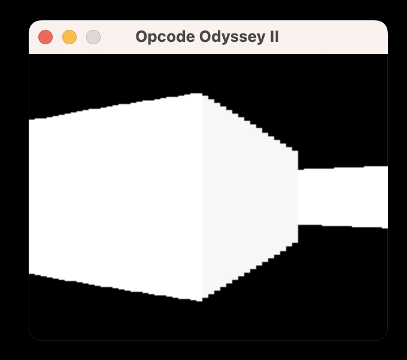

# Opcode Odyssey II: Ray-venge of the Pixels

A basic raycaster developed using x86 assembly for MacOS. This project serves as a learning exercise for delving into assembly language.



## Getting Started

### Prerequisites

To run Opcode Odyssey II, ensure you have the following installed:

1. NASM: The Netwide Assembler, a portable 80x86 and x86-64 assembler.

2. SDL2: A cross-platform development library designed to provide low level access to audio, keyboard, mouse, joystick, and graphics hardware via OpenGL and Direct3D.

### Installation

Clone the repository to your local machine:  

```bash
git clone git@github.com:WLUB/OpcodeOdysseyII.git
```

To compile the code, open your terminal, navigate to the project directory, and run:  

```bash
make all
```
This command generates the object files and the `main` executable.


## Built With

- [NASM](https://www.nasm.us/) - The Netwide Assembler, NASM, is an 80x86 and x86-64 assembler designed for portability and modularity.

- [SDL2](https://www.libsdl.org/) - A cross-platform development library designed to provide low level access to audio, keyboard, mouse, joystick, and graphics hardware via OpenGL and Direct3D.

## Authors

- Lukas Bergström

## Acknowledgments

The System V AMD64 calling convention is used in this game (find more details [here](https://en.wikipedia.org/wiki/X86_calling_conventions#System_V_AMD64_ABI))

## Clean Up

To remove the object and executable files, run:

```bash
make clean
```
This will remove the object files and the executable `main`.

## Future Work

Any suggestions for improvements are welcome.
